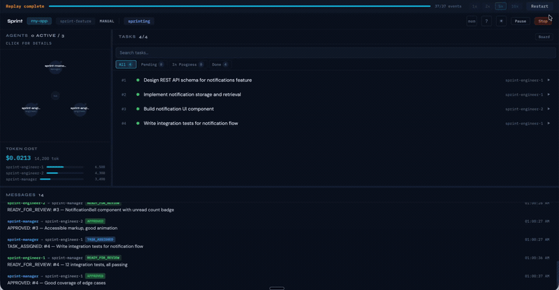
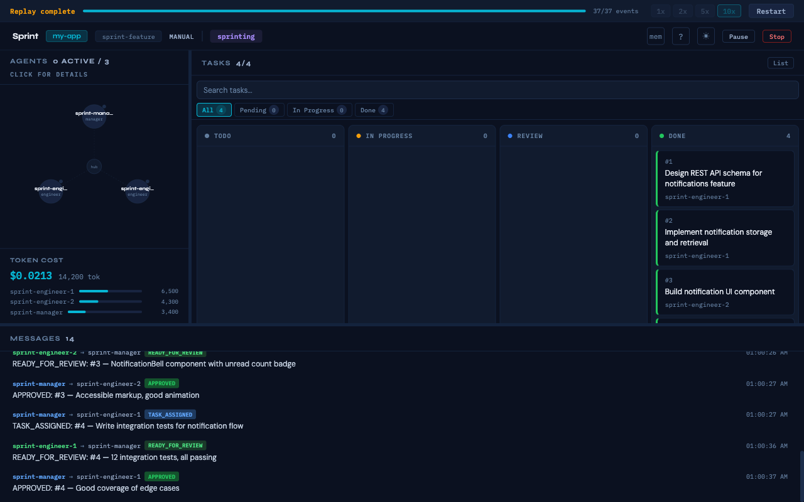
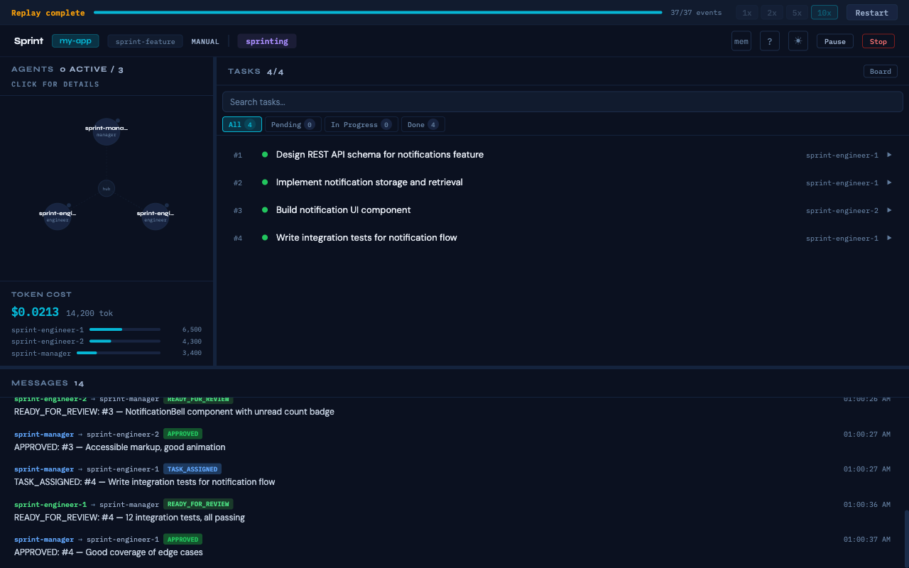

<p align="center">
  
</p>

<h1 align="center">TeamClaude</h1>

<p align="center">
  <strong>Stop flying blind with AI agent teams.</strong><br/>
  Real-time observability and structured sprints for Claude Code.
</p>

<p align="center">
  <a href="https://www.npmjs.com/package/teamclaude"></a>
  <a href="https://github.com/albertnahas/teamclaude/actions/workflows/ci.yml"></a>
  <a href="LICENSE"></a>
</p>

<p align="center">
  
</p>

---

Multi-agent Claude Code sessions are powerful but opaque. You can't see what agents are doing, which tasks are stuck, how much they're costing, or whether the work is actually converging. TeamClaude fixes that with a live dashboard and a manager/engineer sprint workflow that keeps agents on track.

## Get started

```bash
npx teamclaude init
```

This enables Agent Teams, scaffolds agents and commands into `.claude/`, and creates `.teamclaude/` for sprint history. Then open Claude Code and type:

```
/sprint Add user authentication, fix payment bug, refactor database layer
```

The dashboard opens at `http://localhost:3456` and streams everything live.

> **Prerequisites:** Node.js 18+. Optional: [tmux](https://github.com/tmux/tmux) for live terminal views of each agent.

## When to use TeamClaude

| Good fit | Not a good fit |
|---|---|
| Multi-task sprints (3+ related tasks) | Single quick fixes or one-liners |
| Feature batches with review cycles | Exploratory research or brainstorming |
| Bug-bash sessions across a codebase | Tasks requiring constant human decisions |
| Refactoring with test validation | Projects without tests or type-checking |
| Autonomous overnight/background work | Highly sensitive code needing line-by-line review |

## What you get

### Live observability dashboard

See what every agent is doing, in real time.

- **Agent topology** with active/idle status — click any agent to view their live terminal (tmux) or message history
- **Task board** (list or kanban) with real-time status, protocol tags, and review round tracking
- **Message feed** showing inter-agent communication (TASK_ASSIGNED, READY_FOR_REVIEW, APPROVED, etc.)
- **Token cost tracking** per agent with estimated USD cost (model-aware pricing)

<p align="center">
  
</p>

### Structured sprint workflow

Agents don't just run — they follow a review loop.

1. **Manager** assigns tasks to engineers with context
2. **Engineer** implements and submits for review
3. **Manager** approves or requests changes (max 3 rounds)
4. If stuck after 3 rounds, it **escalates to you**

This prevents the common failure mode: agents running indefinitely without converging.

### Sprint analytics and retros

Every sprint generates data.

- **Retrospective** — auto-generated markdown on sprint stop (summary, task results, team performance, improvement suggestions)
- **Sprint history** — completion rates, review rounds, velocity trends across cycles
- **Sprint replay** — re-watch any recorded sprint in the dashboard at adjustable speed
- **Git integration** — auto-creates sprint branches, generates PR summaries

<p align="center">
  
</p>

### Cost control

- **Token budget** — auto-pause when spend exceeds a threshold, with dashboard warnings at 80%
- **Human checkpoints** — pause before specific tasks for manual review
- **Model routing** — automatically assigns haiku/sonnet/opus per task based on complexity

## Modes

### Manual — you define the work

```
/sprint Add user auth, fix payment bug, refactor DB layer
/sprint path/to/ROADMAP.md
```

You see the parsed task list and approve before anything starts.

### Autonomous — PM agent drives

```
/sprint
```

A PM agent analyzes the codebase, creates a roadmap, and hands it to the manager. Runs in continuous cycles until no issues remain.

## Configuration

Auto-detects your project tooling from lockfiles and `package.json`. For explicit control, add `.sprint.yml`:

```yaml
agents:
  model: sonnet              # haiku | sonnet | opus
  roles:                     # custom team composition
    - engineer
    - engineer
    - qa

sprint:
  max_review_rounds: 3

budget:
  max_tokens: 100000
  warn_at: 80000

verification:
  type_check: "npm run type-check"
  test: "npm test"

server:
  port: 3456
```

## CLI

```bash
npx teamclaude init [--global] [--force]            # Scaffold into .claude/
npx teamclaude init --template <name|list>           # Use a pre-built template
npx teamclaude start [--port N]                      # Start server (default: 3456)
npx teamclaude replay <file.jsonl> [--speed N]       # Replay a recorded sprint
```

## Alternative install

```bash
# Claude Code plugin marketplace
claude plugin marketplace add albertnahas/teamclaude
claude plugin install teamclaude@teamclaude

# Standalone server
npx teamclaude start
```

---

<details>
<summary><strong>Agent roles</strong></summary>

| Agent | Role |
|-------|------|
| **sprint-pm** | Analyzes codebase, creates roadmaps, validates results. Never writes code. (Autonomous mode only) |
| **sprint-manager** | Delegates tasks, reviews code, drives sprint to completion. Never writes code. |
| **sprint-engineer** | Implements features, fixes bugs, writes tests. Submits work for review. |
| **sprint-qa** | Validates acceptance criteria, runs tests, reports defects. Never writes code. |
| **sprint-tech-writer** | Updates docs, changelogs, inline comments. Never writes code. |

Custom roles: drop an `agents/<role>.md` file and reference it in `.sprint.yml`.

</details>

<details>
<summary><strong>Message protocol</strong></summary>

Agents communicate via structured prefixed messages:

| Prefix | Direction | Meaning |
|--------|-----------|---------|
| `TASK_ASSIGNED:` | Manager → Engineer | Task delegated with context |
| `READY_FOR_REVIEW:` | Engineer → Manager | Work submitted for review |
| `APPROVED:` | Manager → Engineer | Work accepted, task complete |
| `REQUEST_CHANGES:` | Manager → Engineer | Feedback with round counter (N/3) |
| `RESUBMIT:` | Engineer → Manager | Revised work after feedback |
| `ESCALATE:` | Either → Human | Stuck after 3 rounds |
| `ROADMAP_READY:` | PM → Manager | Sprint tasks created (autonomous) |
| `SPRINT_COMPLETE:` | Manager → PM | All tasks done (autonomous) |
| `ACCEPTANCE:` | PM → Manager | Validation pass/fail (autonomous) |

</details>

<details>
<summary><strong>REST API</strong></summary>

| Endpoint | Method | Description |
|----------|--------|-------------|
| `/api/state` | GET | Full sprint state snapshot |
| `/api/launch` | POST | Launch a sprint (`{ roadmap, engineers, includePM, cycles }`) |
| `/api/stop` | POST | Stop sprint, record analytics, generate retro + PR summary |
| `/api/pause` | POST | Toggle pause/resume |
| `/api/resume` | POST | Resume persisted sprint after server restart |
| `/api/process-status` | GET | Running process info (PID, startedAt) |
| `/api/analytics` | GET | Sprint history (`?cycle=N&limit=N&format=csv`) |
| `/api/retro` | GET | Last retrospective (`?format=json`) |
| `/api/retro/gist` | POST | Publish retro to GitHub Gist |
| `/api/retro/diff` | GET | Diff two sprints (`?a=<id>&b=<id>`) |
| `/api/history` | GET | All sprint history entries |
| `/api/history/:id/retro` | GET | Retro for a past sprint |
| `/api/velocity.svg` | GET | Velocity chart SVG (`?w=N&h=N`) |
| `/api/plan` | GET | Task dependency analysis + model routing |
| `/api/task-models` | GET | Model routing per task |
| `/api/git-status` | GET | Branch status |
| `/api/checkpoint` | POST | Set human checkpoint (`{ taskId }`) |
| `/api/checkpoint/release` | POST | Release pending checkpoint |
| `/api/templates` | GET | Available sprint templates |
| `/api/memories` | GET/POST | Agent memory store (`?role=X&q=query`) |
| `/api/memories/:id` | DELETE | Delete a memory |

WebSocket events: `init`, `task_updated`, `message_sent`, `agent_status`, `token_usage`, `checkpoint`, `cycle_info`, `paused`, `escalation`, `terminal_output`, `panes_discovered`, `merge_conflict`.

</details>

<details>
<summary><strong>Plugin API</strong></summary>

Drop a `.js` file into `.teamclaude/plugins/`:

```javascript
export default {
  name: "notify",
  hooks: {
    onSprintStart(state) { console.log(`Sprint started: ${state.teamName}`); },
    onTaskComplete(task) { console.log(`Task done: ${task.subject}`); },
    onSprintStop(state) { console.log(`Sprint stopped`); },
  },
};
```

Hooks: `onSprintStart`, `onTaskComplete`, `onEscalation`, `onSprintStop`. Errors are caught — they never crash the server.

</details>

<details>
<summary><strong>GitHub integration</strong></summary>

Auto-create issues from tasks and post retros as PR comments:

```yaml
github:
  repo: "your-org/your-repo"
  pr_number: 42
```

Set `GITHUB_TOKEN` in your environment (needs `issues:write` and `pull_requests:write`).

</details>

<details>
<summary><strong>How it works</strong></summary>

```
~/.claude/teams/<team>/config.json     ──┐
~/.claude/teams/<team>/inboxes/*.json  ──┤  chokidar
~/.claude/tasks/<team>/*.json          ──┘  watches
                                           │
                                     ┌─────▼─────┐
              tmux (panes) ◄────────►│   server   │
              capture-pane           │ HTTP + WS  │
              send-keys              └─────┬──────┘
                                           │
                                     ┌─────▼─────┐
                                     │  browser   │
                                     │ xterm.js   │
                                     └────────────┘
```

The server watches Claude Code's native Agent Teams filesystem and streams deltas via WebSocket. When tmux is available, it polls panes for terminal output and relays keyboard input. On sprint stop, it records analytics, generates a retrospective, and creates a PR summary.

</details>

## License

MIT
